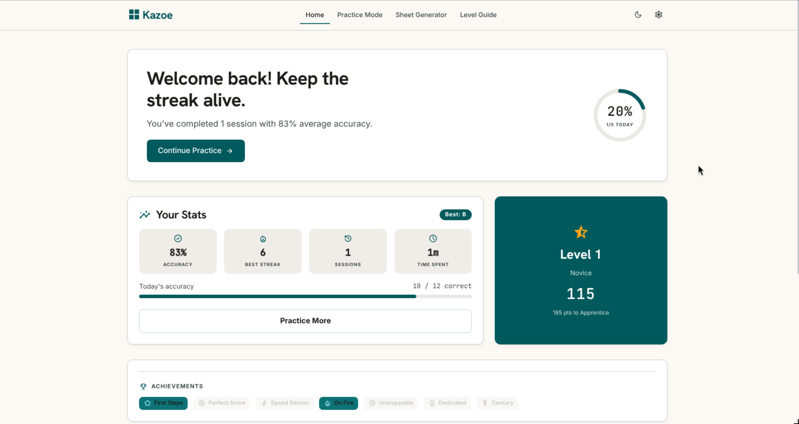
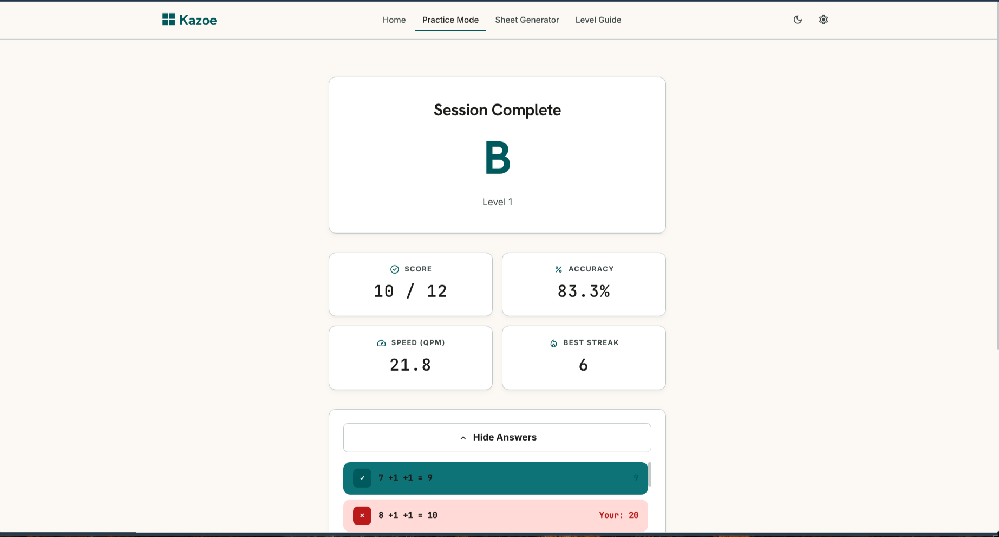
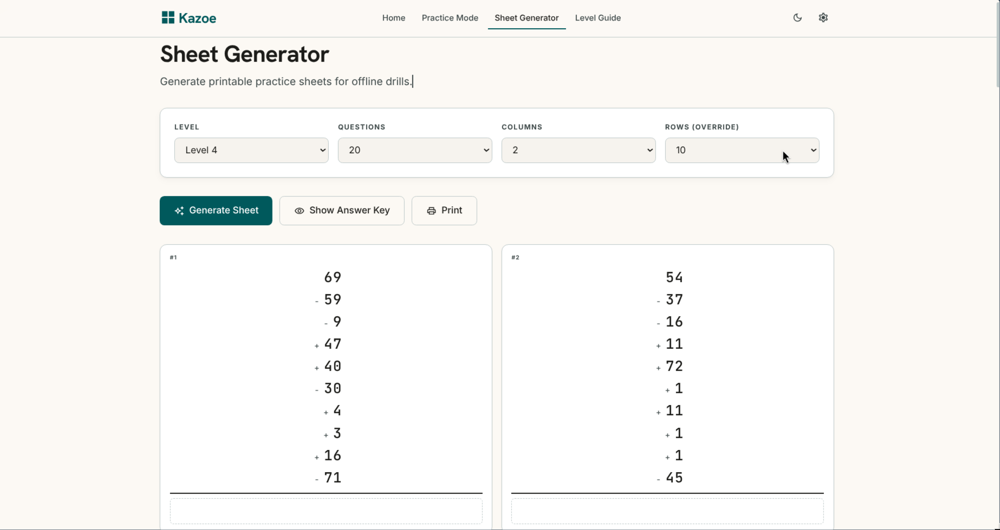
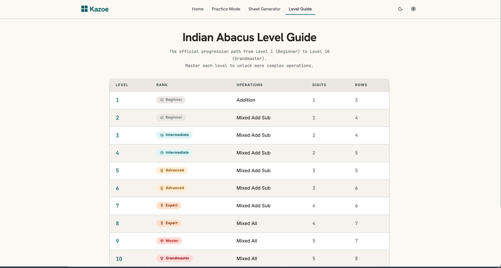

# Kazoe 🧮

**Soroban-style mental arithmetic training platform.**  
Sharpen your calculation speed and precision through timed drills, printable practice sheets, and a structured 10-level Indian abacus curriculum — all in a modern offline-capable web app.

<div align="center">


*Your personal dashboard — track sessions, accuracy trends, rank progression, and achievements at a glance.*

<br/>


*Configure your drill with level, duration, and operand settings, then race against the clock.*

<br/>


*Generate printable A4 practice sheets with answer keys — perfect for offline drills.*

<br/>


*Browse the full curriculum from Beginner to Grandmaster with detailed level breakdowns.*

</div>

---

## Features

### ⚡ Timed Practice Mode
Configure level, duration (0.5–15 min), and operand rows, then race against the clock through a sequence of addition/subtraction problems. Questions are deterministically generated from a seed — the same seed + level always produces the same problem set, enabling fair comparisons and shareable challenge links.

- **Session Guard** prevents accidental navigation during active tests
- **Real-time timer** with visible countdown and warning state
- **Skip & Submit** flow with keyboard shortcuts (`Enter` to submit, `Esc` to skip)
- **Instant results** with letter grade (S/A/B/C/D), accuracy %, speed (QPM), and best streak
- Results persisted to `localStorage` for long-term tracking

### 🏆 Rank & Progression System
Earn points (10 per correct answer + grade bonus) to climb 8 tiers:

| Rank | Points Required |
|------|----------------|
| Beginner | 0 |
| Novice | 100 |
| Apprentice | 300 |
| Intermediate | 600 |
| Advanced | 1,200 |
| Expert | 2,000 |
| Master | 3,500 |
| Grandmaster | 5,000 |

A daily goal of 5 sessions is tracked with a visual progress ring on the dashboard.

### 📄 Sheet Generator
Generate printable A4 practice sheets with on-screen preview and CSS-driven print layout (4 questions per page, 2×2 grid). Supports:

- Level and row-count override
- Configurable question count (10–50)
- Answer key pages (toggleable)
- Name/Date fields for classroom use
- PDF export via `@react-pdf/renderer`

### 📚 Level Guide
Reference table mapping Indian abacus levels 1–10 with their operations, digit counts, and row counts.

---

## Indian Abacus Curriculum

| Level | Rank | Operations | Digits | Rows |
|-------|------|-----------|--------|------|
| 1 | Beginner | Addition | 1 | 3 |
| 2 | Beginner | Mixed ± | 1 | 4 |
| 3 | Intermediate | Mixed ± | 2 | 4 |
| 4 | Intermediate | Mixed ± | 2 | 5 |
| 5 | Advanced | Mixed ± | 3 | 5 |
| 6 | Advanced | Mixed ± | 3 | 6 |
| 7 | Expert | Mixed ± | 4 | 6 |
| 8 | Expert | Mixed All | 4 | 7 |
| 9 | Master | Mixed All | 5 | 7 |
| 10 | Grandmaster | Mixed All | 5 | 8 |

**Key abacus invariant:** The running total during a question never goes below zero — mirroring the physical constraint that you cannot subtract beads you don't have.

---

## Project Architecture

```
src/
├── components/
│   ├── layout/         # App shell — navbar, footer, outlet
│   │   └── Layout.tsx
│   ├── practice/       # Config, test interface, results
│   │   ├── ConfigPanel.tsx
│   │   ├── TestInterface.tsx
│   │   └── ResultScreen.tsx
│   └── sheet/          # PDF document component
│       └── SheetPDFDocument.tsx
├── pages/
│   ├── Home.tsx         # Dashboard — stats, rank, history
│   ├── PracticeMode.tsx # Session config wrapper
│   ├── SheetGenerator.tsx # Print sheet generator
│   └── LevelGuide.tsx   # Curriculum reference
├── router/
│   └── index.tsx        # React Router config + route guards
├── store/
│   └── useAppStore.ts   # Zustand global state (theme, session, history, sheets)
├── utils/
│   ├── questionGenerator.ts # Seeded add/sub question generation
│   ├── questionGenerator.test.ts
│   ├── grading.ts       # Session result computation & grade assignment
│   └── levelConfig.ts   # Level 1–10 curriculum definitions
├── index.css            # Tailwind v4 + Stitch design system + print styles
├── App.tsx
└── main.tsx
```

### State Management
Global state is managed via **Zustand** with `localStorage` persistence for:
- Theme preference (`light` / `dark`)
- Session history (all completed practice sessions)
- Practice configuration (level, time, seed, overrides)

### Question Generation
Questions are generated using `seedrandom` for **deterministic, reproducible** problem sets. The generator:
1. Starts with a positive first operand biased upward for subtraction-heavy levels
2. For each subsequent row, decides add vs. subtract based on level config
3. Ensures running total stays within `[0, maxVal]` at every step
4. Respects digit-count ceiling and operation type constraints

### Grading
Grades are computed from accuracy and speed relative to the level's target QPM:

| Grade | Requirements |
|-------|-------------|
| **S** | Accuracy ≥ 95%, Speed ≥ 100% of target |
| **A** | Accuracy ≥ 88%, Speed ≥ 80% of target |
| **B** | Accuracy ≥ 75%, Speed ≥ 60% of target |
| **C** | Accuracy ≥ 60% |
| **D** | Below 60% |

---

## Getting Started

### Prerequisites
- Node.js ≥ 20
- npm ≥ 10

### Installation

```bash
git clone <repository-url>
cd kazoe
npm install
```

### Development

```bash
npm run dev      # Start Vite dev server (default: http://localhost:5173)
```

### Build

```bash
npm run build    # Type-check + bundle
npm run preview  # Serve the built app locally
```

### Testing

```bash
npm test         # Run vitest (7 tests: question generator invariants)
npm run test:watch  # Watch mode
```

### Linting

```bash
npm run lint     # ESLint with TypeScript + React Hooks rules
```

---

## Tech Stack

| Category | Technology |
|----------|-----------|
| **Framework** | React 19, TypeScript 6 |
| **Build** | Vite 8 |
| **Styling** | Tailwind CSS 4 (with `@theme` design tokens) |
| **Routing** | React Router 7 |
| **State** | Zustand 5 |
| **Testing** | Vitest 4 |
| **PDF** | `@react-pdf/renderer` |
| **Icons** | Material Symbols Outlined, Lucide React |
| **Fonts** | Hanken Grotesk, Inter, JetBrains Mono |
| **PRNG** | seedrandom 3 (deterministic question generation) |

---

## Configuration

### URL Parameters (Practice Mode)
Start a practice session with pre-configured parameters via query params:
```
/practice?level=4&time=120&seed=ABC123
```

### Theme
- Toggle between light and dark mode via the navbar button
- Preference is persisted to `localStorage('kazoe-theme')`
- Default respects `prefers-color-scheme`

### Level Overrides
Each level's row count can be overridden independently — useful for custom difficulty or targeted practice on specific operand counts.

---

## License

Private project — all rights reserved.

---

<p align="center">Precision in every bead.</p>
